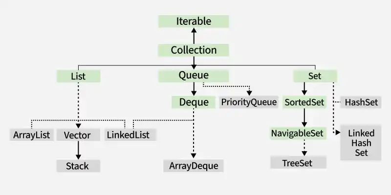

Iterable Interface has iterate absract method which is implemented by class ex arrayList, HastSET

iterator method expects you to return Iterator object of iterator interface  which will have methods like next() hasnext()

hence arrayList has nested class which implements iterator interface with methods next() and hasnext() whose object is returned by iterate method within arrayList

Iterable methods: --> (iterator(), forEach(), splitIterator())
Iterator methods: --> (hasNext(), next(),remove())

Conconrrent Modification Exception it throws when it is modified while Iterating

// In Java size of bucket is 16 and when load factor cross .75 it gets doubled

// also in Java there is no data structure called set and internally it implement map like key, Present where present is dummay static Object
hence hashset, linkedhashset, and treeset internally uses hashmap, linkedhashmap and treemap

// Treefication 

// Internally in chainging when it elongated it is converted into selft balacing tree called BST

Note : HashMap, Hashset or linkedHashMap or LinkedhasSET 
==> key can be Null once and value can be Null anytimes

In treeMap and TreeSET Null is not allowed at all

