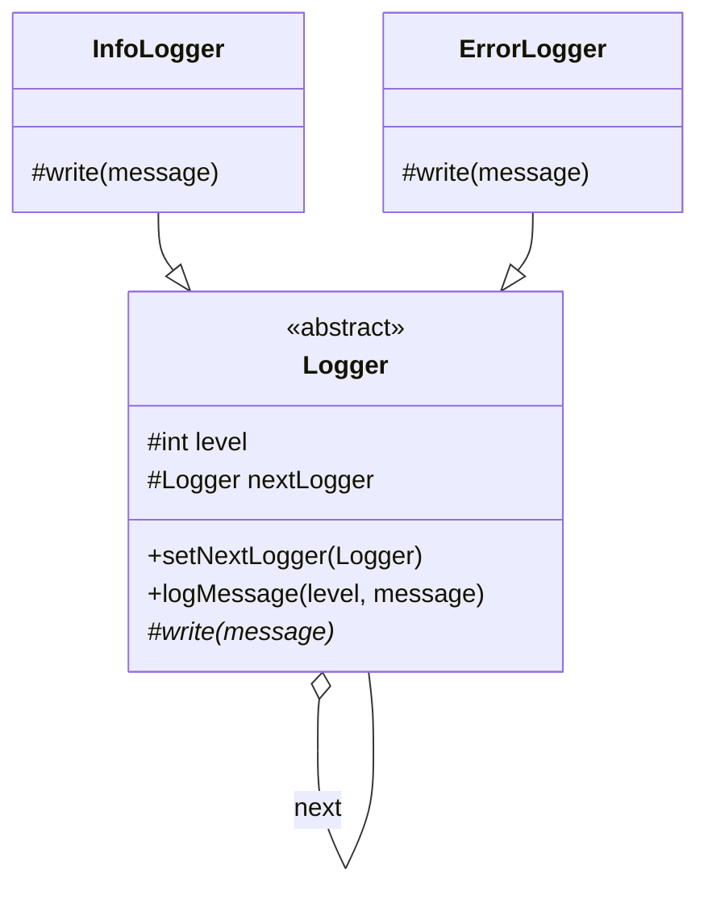

# Chain of Responsibility Pattern

**Category:** Behavioral

## Definition
The Chain of Responsibility pattern passes requests along a chain of handlers. Upon receiving a request, each handler decides either to process the request or to pass it to the next handler in the chain.

## Real-World Analogy
Think of **Calling Customer Support**. 
You have an issue. You call the helpline, and a **Level 1 Agent (Bot)** picks up. If it's a simple password reset, the bot handles it. If it's too complex, the bot passes you to a **Level 2 Agent (Human)**. If the human can't solve it, they pass you to the **Manager**. 
The request travels along a "chain" until someone takes responsibility for it.

## UML Diagram

## Common Myths & Debusting
- **Myth 1: "Every handler in the chain must process the request."**
  *Reality:* In a pure Chain of Responsibility, a handler usually *either* processes the request *or* passes it on. However, in some variations (like the Logger example provided here, or Servlet Filters), multiple handlers might process the same request before passing it along.
- **Myth 2: "It's the same as a Decorator."**
  *Reality:* While they both link objects, Decorators add behavior and *always* pass the request down the chain. Chain of Responsibility handlers can *stop* the chain entirely at any point.

## Code Example Summary
- `BadLogger.java`: Uses multiple nested `if-else` blocks to determine how to handle logging based on the log level.
- `Logger.java`: The abstract Handler class that contains the logic for passing the request to the `nextLogger`.
- `InfoLogger.java`, `ErrorLogger.java`: Concrete handlers that implement their specific logging behavior.
