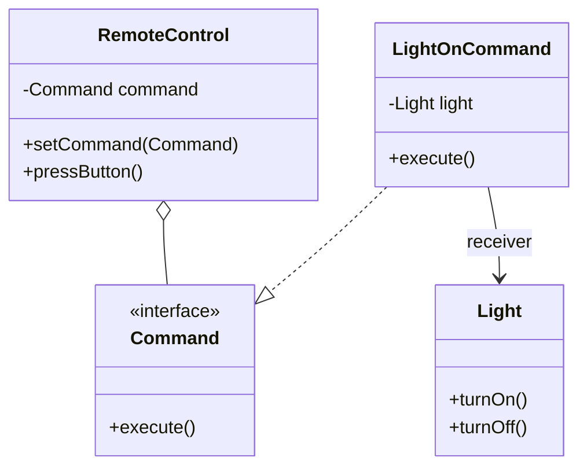

# Command Pattern

**Category:** Behavioral

## Definition
The Command pattern encapsulates a request as an object, thereby letting you parameterize clients with different requests, queue or log requests, and support undoable operations.

## Real-World Analogy
Think of a **Restaurant Order**. 
You (Client) give an order to the Waiter (Invoker). The Waiter doesn't cook the food; they write the order on a piece of paper (Command). They put the paper on the counter. Later, the Chef (Receiver) reads the paper and cooks the food.
The Waiter is completely decoupled from the Chef. They only know how to take the paper and pass it along. Furthermore, since the order is on a piece of paper, it can be queued, delayed, or canceled!

## UML Diagram

## Common Myths & Debusting
- **Myth 1: "Command pattern is just a fancy callback."**
  *Reality:* While it achieves a similar result to passing a callback function, the Command *object* is much more powerful. Because it is an object, it can store state (like previous values for an `undo()` method), it can be serialized and sent over a network, and it can be placed in a Queue for delayed execution.
- **Myth 2: "Every Command needs an `undo()` method."**
  *Reality:* `undo()` is a *common feature* added to the Command pattern (especially in text editors or games), but the core definition of the pattern only strictly requires an `execute()` method to decouple the Invoker from the Receiver.

## Code Example Summary
- `BadSmartHome.java`: The UI buttons (Invoker) are directly hardcoded to call the Light (Receiver) methods. If you want to change what a button does, you have to rewrite the button class!
- `Command.java`: The core interface.
- `Light.java`: The Receiver that actually knows how to do the work.
- `LightOnCommand.java`: The Command object that wraps the Receiver.
- `RemoteControl.java`: The Invoker. It doesn't know about Lights or TVs. It just knows it has a `Command` and it can `execute()` it when a button is pressed.
