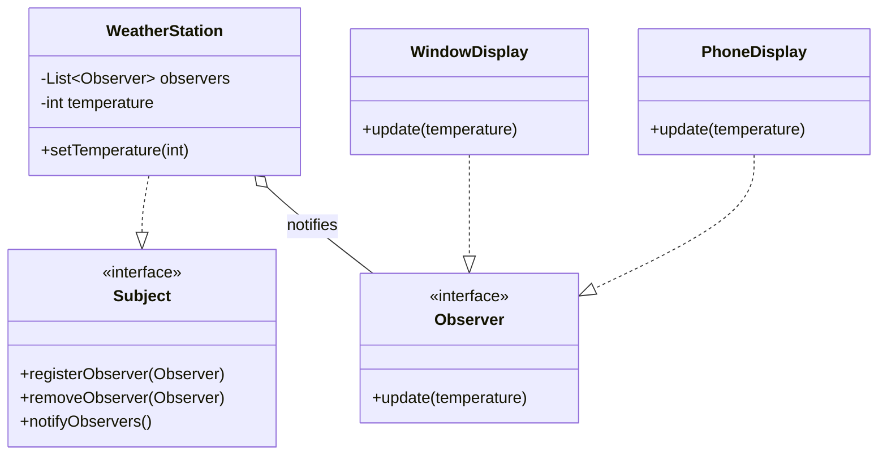

# Observer Pattern

**Category:** Behavioral

## Definition
The Observer pattern defines a one-to-many dependency between objects so that when one object (the Subject) changes state, all its dependents (Observers) are notified and updated automatically.

## Real-World Analogy
Think of a **YouTube Channel Subscription**. 
The Channel is the **Subject** (Publisher). You and millions of others are the **Observers** (Subscribers). 
When the Channel uploads a new video, they don't manually message every single person. Instead, because you "subscribed", the system automatically sends a notification to you and everyone else on the list. If you "unsubscribe", you stop getting notified.

## UML Diagram

## Common Myths & Debusting
- **Myth 1: "Observer is the exact same as Pub-Sub (Publisher-Subscriber)."**
  *Reality:* They are conceptually similar but architecturally different. 
  - **Observer:** The Subject and Observer know about each other (Subject holds a list of Observers). It's usually synchronous.
  - **Pub-Sub:** There is a "Message Broker" or "Event Bus" in between. The Publisher and Subscriber do *not* know about each other. It's heavily used in microservices (e.g., Kafka, RabbitMQ).
- **Myth 2: "Java has built-in `Observer` and `Observable`, so I should use them."**
  *Reality:* Java's built-in `Observable` is a class, not an interface, which breaks inheritance rules (you can't subclass it if you already extend another class). It was deprecated in Java 9. You should always write your own interfaces or use `PropertyChangeListener`.

## Code Example Summary
- `BadWeatherStation.java`: Hardcodes the updates to specific display classes. Every time you add a new display, you modify the station (Violates OCP).
- `Subject.java` & `Observer.java`: The core interfaces.
- `WeatherStation.java`: The Concrete Subject holding the state (temperature).
- `PhoneDisplay.java`, `WindowDisplay.java`: Concrete Observers that react to changes in the WeatherStation.
