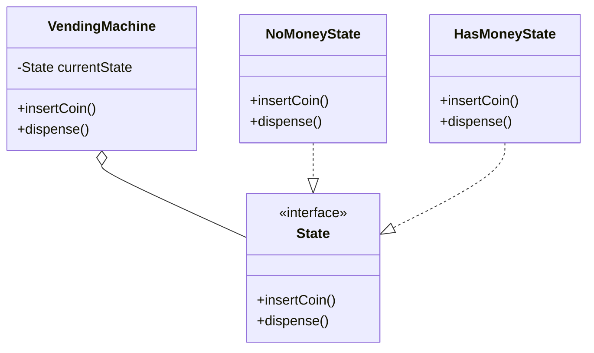

# State Pattern

**Category:** Behavioral

## Definition
The State pattern allows an object to alter its behavior when its internal state changes. It appears as if the object changed its class. 

## Real-World Analogy
Think of a **Smartphone**. 
When the phone is in a "Locked" state, pressing the power button wakes up the screen. When the phone is in an "Unlocked" state, pressing the power button puts it to sleep. The *same action* (pressing the power button) results in completely *different behaviors* depending on the internal *state* of the phone.

## UML Diagram

## Common Myths & Debusting
- **Myth 1: "State and Strategy are the same pattern."**
  *Reality:* Structurally, they are almost identical. But in **Strategy**, the client injects the behavior, and the strategies are completely unaware of each other. In **State**, the states are aware of each other and usually trigger the transitions from one state to another (e.g., `HasMoneyState` transitioning the machine to `DispensingState`).
- **Myth 2: "State pattern removes all `if-else` statements."**
  *Reality:* It removes the giant `if-else` block *inside the Context object*. However, you might still have some logic inside the Concrete State classes to determine when to transition to the next state.

## Code Example Summary
- `BadVendingMachine.java`: Uses an Enum or String to track the current state and has giant `if-else` blocks in every single method to figure out what to do based on the current state.
- `State.java`: The state interface defining all possible actions (insertCoin, dispense).
- `NoMoneyState.java` & `HasMoneyState.java`: Concrete states that encapsulate the behavior for that specific state, and often handle transitioning the Context to a new state.
- `VendingMachine.java`: The Context class. It just delegates the action to whatever `currentState` it is currently holding.
