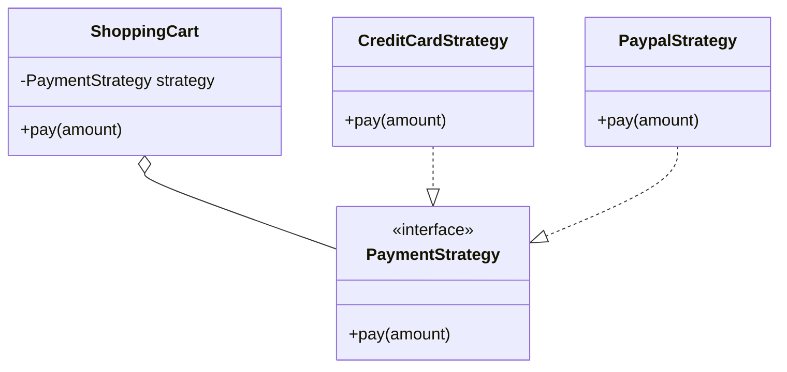

# Strategy Pattern

**Category:** Behavioral

## Definition
The Strategy pattern defines a family of algorithms, encapsulates each one, and makes them interchangeable. Strategy lets the algorithm vary independently from clients that use it.

## Real-World Analogy
Think of navigating to the airport. 
You can choose a **Strategy**: Drive your own car, take a Taxi, ride a Bicycle, or take a Bus. 
Your primary goal (reach the airport) remains the same, but the algorithm (how you get there) changes based on cost, time, and preference. You can swap these strategies dynamically at runtime.

## UML Diagram

## Common Myths & Debusting
- **Myth 1: "Strategy is exactly the same as State pattern."**
  *Reality:* Structurally, they look identical (a Context class delegating to an Interface). However, the *intent* is different. 
  - **Strategy:** The client usually chooses the strategy (e.g., choosing PayPal vs Credit Card). The strategies don't know about each other.
  - **State:** The state changes internally based on rules. States know about each other and trigger transitions (e.g., Vending Machine moving from `HasMoneyState` to `DispensingState`).
- **Myth 2: "You should use Strategy for every single `if-else` block."**
  *Reality:* If you only have two algorithms and they rarely change, an `if-else` is perfectly fine. Overusing Strategy leads to class explosion.

## Code Example Summary
- `BadPaymentProcessor.java`: A giant switch statement handling every single payment method. Adding a new method requires modifying this class (violating Open/Closed Principle).
- `PaymentStrategy.java`: The common interface for all algorithms.
- `CreditCardStrategy.java`, `PaypalStrategy.java`: The concrete algorithms.
- `ShoppingCart.java`: The Context that uses the Strategy. It delegates the payment to whatever strategy the client injects.
