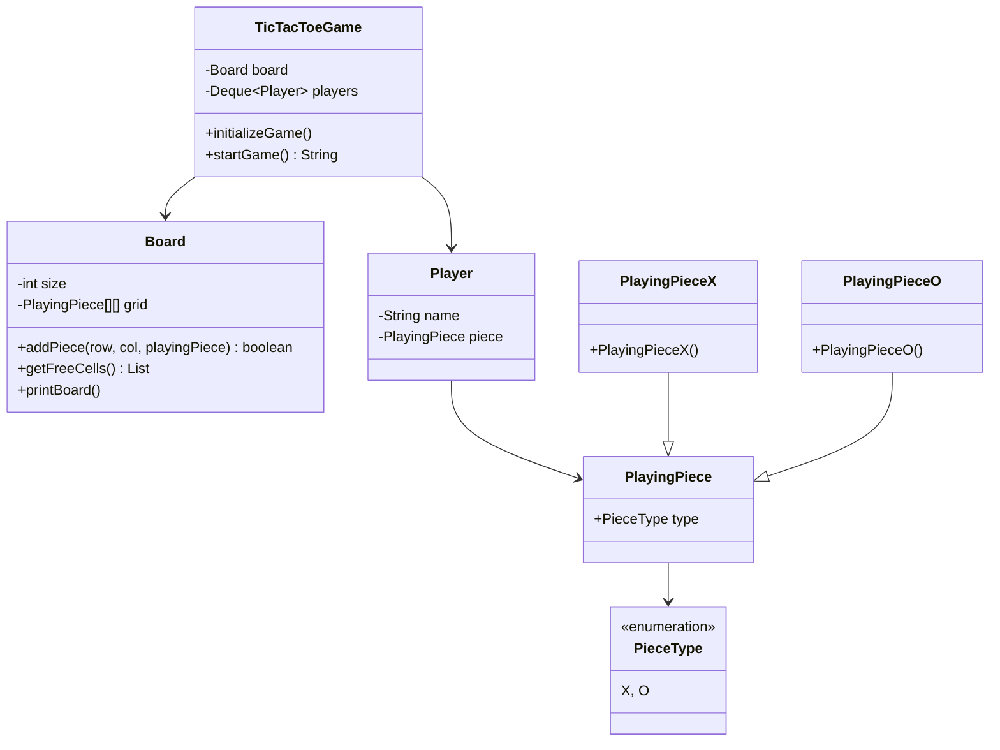

# Tic-Tac-Toe Machine Coding (LLD)

**Category:** LLD Case Study

## Problem Statement
Design a classic Tic-Tac-Toe game where two players can play against each other on an N x N grid (typically 3x3).

## Entities Identified (Nouns)
1. **Game / Match**: Orchestrates the flow.
2. **Board**: The N x N grid holding the pieces.
3. **Player**: A user with a name and a chosen piece.
4. **PlayingPiece**: The X or O marker on the board.

## UML / Class Diagram

## Applied Principles & Patterns
- **Single Responsibility Principle (SRP):** The `Board` only cares about placing pieces and managing the grid. The `TicTacToeGame` handles the turn-by-turn game loop and win validation.
- **Open/Closed Principle (OCP):** We created `PlayingPiece` as a base class. If we ever want to extend this game to support a new piece (like a Triangle 'T' for a 3-player variation), we just create `PlayingPieceT extends PlayingPiece` without changing existing pieces.

## Code Example Summary
- `PieceType.java`: Enum containing `X` and `O`.
- `PlayingPiece.java`: Base class for pieces.
- `PlayingPieceX.java`, `PlayingPieceO.java`: Specific pieces, passing their type to the parent constructor.
- `Board.java`: Manages the 2D array of `PlayingPiece`.
- `Player.java`: Binds a user's name to their chosen `PlayingPiece`.
- `TicTacToeGame.java`: The core logic, initializing the board and handling the game loop using a Double-Ended Queue (Deque) for turn management.
