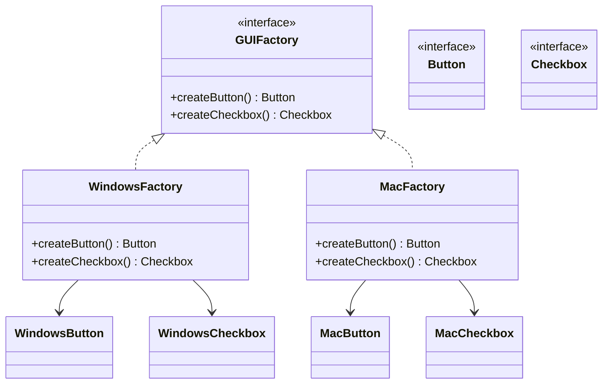

# Abstract Factory Pattern

**Category:** Creational

## Definition
The Abstract Factory pattern provides an interface for creating **families of related or dependent objects** without specifying their concrete classes. It is essentially a "factory of factories".

## Real-World Analogy
Think of a **Furniture Shop**. They sell families of products: Modern, Victorian, and Art Deco. For each style, there is a Chair, a Sofa, and a Coffee Table. 
You wouldn't want to mix a Modern Chair with a Victorian Sofa. The Abstract Factory ensures that when you ask for "Victorian Furniture", all the pieces you get (Chair, Sofa, Table) are guaranteed to match the Victorian style.

## UML Diagram

## Common Myths & Debusting
- **Myth 1: "Abstract Factory is just a Factory Method with a different name."**
  *Reality:* Factory Method creates *one* specific object. Abstract Factory creates a *family* of related objects. An Abstract Factory usually uses Factory Methods internally to create the individual objects.
- **Myth 2: "It's always better than a simple Factory Method."**
  *Reality:* Abstract Factory introduces a lot of classes and interfaces. If you don't actually have "families" of products that must match (like MacOS vs Windows UI components), it is massive overkill.

## Code Example Summary
- `BadGUI.java`: Uses raw `if/else` statements for *every single component* created, leading to a risk of mixing Windows buttons with Mac checkboxes by accident.
- Interfaces: `Button`, `Checkbox`, `GUIFactory`
- Concrete Products: `WindowsButton`, `MacButton`, `WindowsCheckbox`, `MacCheckbox`
- Concrete Factories: `WindowsFactory`, `MacFactory`
