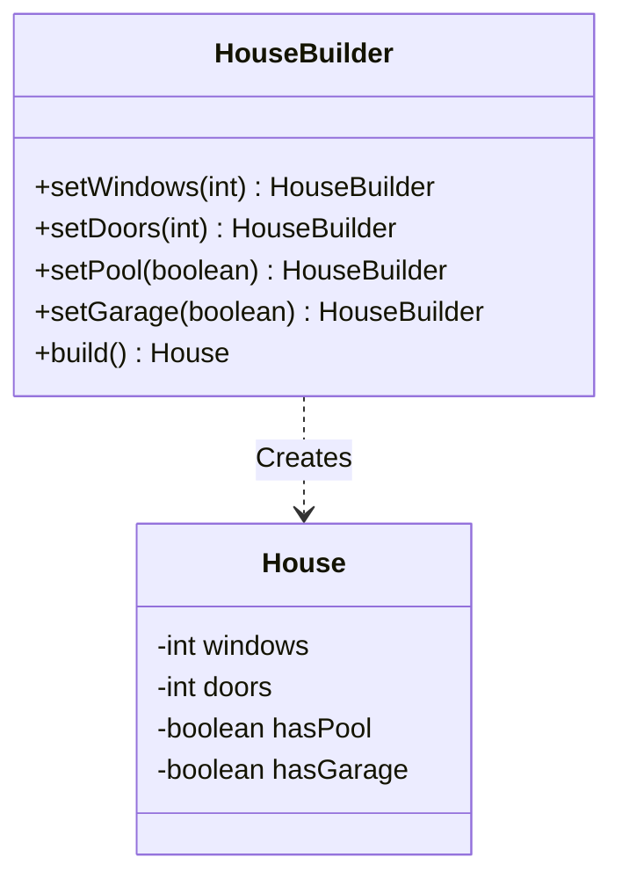

# Builder Pattern

**Category:** Creational

## Definition
The Builder pattern separates the construction of a complex object from its representation. It allows you to construct complex objects step by step and produce different types and representations of an object using the same construction code.

## Real-World Analogy
Think of ordering a **Custom PC**. A PC has many parts: CPU, GPU, RAM, Storage, Cooling, etc. 
Instead of a giant constructor where you have to pass 15 parameters (`new PC("Intel", "Nvidia", 16, 512, false, true...)`), you talk to a "Builder" (a website or a person). You say, "Add 16GB RAM", then "Add an Nvidia GPU", and finally, "Build it".

## UML Diagram

## Common Myths & Debusting
- **Myth 1: "Lombok's `@Builder` annotation means I don't need to understand the pattern."**
  *Reality:* While Lombok generates the boilerplate, understanding *why* it's generated (to avoid the Telescoping Constructor anti-pattern) is crucial for interviews. Furthermore, the GoF Builder pattern uses a `Director` class to encapsulate complex building steps, which Lombok does not do out of the box.
- **Myth 2: "Builder is only for objects with lots of fields."**
  *Reality:* It's also incredibly useful for enforcing immutability. You can make all fields in the target object `final` and only set them via the Builder.

## Code Example Summary
- `BadHouse.java`: Demonstrates the "Telescoping Constructor" anti-pattern, where you have multiple constructors handling different combinations of optional parameters.
- `House.java`: The final product, which is immutable (only getters, no setters).
- `HouseBuilder.java`: The builder class that fluently sets up the `House`.
