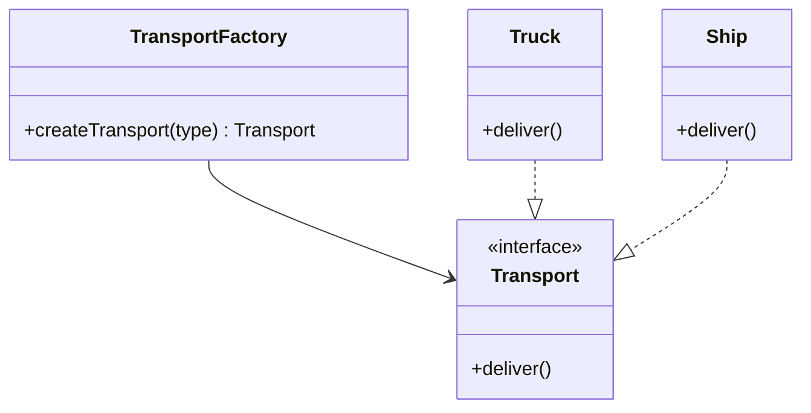

# Factory Method Pattern

**Category:** Creational

## Definition
The Factory Method pattern defines an interface for creating an object, but lets subclasses or a dedicated factory class decide which class to instantiate. It delegates the object creation logic to a dedicated "Factory".

## Real-World Analogy
Imagine a **Logistics Company**. Initially, they only use Trucks. The code is tightly coupled to the `Truck` class. Later, they add Ships. If object creation is scattered everywhere, you have to find and modify every `new Truck()` statement. 
A Factory acts like a **Dispatch Center**. You ask the Dispatch Center for a transport vehicle, and based on the route (road vs. sea), it internally decides whether to build a `Truck` or a `Ship`.

## UML Diagram

## Common Myths & Debusting
- **Myth 1: "Factory pattern is just a method with a giant switch statement."**
  *Reality:* While a Simple Factory often uses a switch statement (like our example here for simplicity), the true *Factory Method* pattern uses polymorphism (subclassing the Factory itself) to override the creation method, eliminating the switch statement completely.
- **Myth 2: "Always use a Factory instead of the `new` keyword."**
  *Reality:* Using `new` is perfectly fine for basic data structures or simple objects. Only use Factories when object creation involves complex logic, or when the system needs to decide the exact class at runtime based on parameters.

## Code Example Summary
- `BadLogistics.java`: Directly uses `new Car()` and `new Bike()`. If a new vehicle is added, the client code itself must change, violating the Open/Closed Principle.
- `Transport.java`: The common interface.
- `Car.java`, `Bike.java`: Concrete implementations.
- `TransportFactory.java`: The central place that handles the creation logic.
