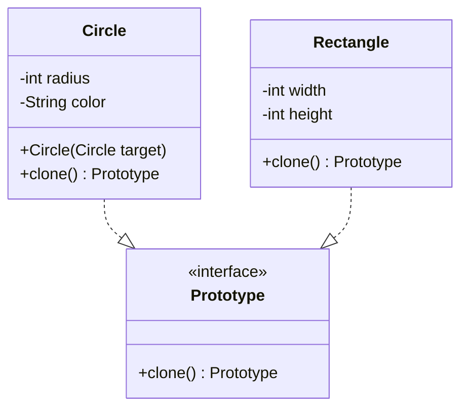

# Prototype Pattern

**Category:** Creational

## Definition
The Prototype pattern lets you copy existing objects without making your code dependent on their classes. It delegates the cloning process to the actual objects that are being cloned.

## Real-World Analogy
Think of a **Cell Division (Mitosis)**. When a cell splits, it doesn't build a new cell from scratch by finding proteins one by one. It creates a perfect copy (clone) of itself. 
In software, if you have an object configured in a very specific, complex way (e.g., pulling data from a database), it is much faster to just "clone" the existing object rather than creating a new one and repeating the DB query.

## UML Diagram

## Common Myths & Debusting
- **Myth 1: "Java's `Cloneable` interface is the perfect way to do this."**
  *Reality:* Java's built-in `Cloneable` is highly flawed and considered bad practice by many (including Joshua Bloch). It does shallow copying by default and relies on empty marker interfaces. It is often better to define your own `clone()` method or provide a copy constructor.
- **Myth 2: "Cloning is always faster than using `new`."**
  *Reality:* `new` is incredibly fast in modern JVMs. You should use Prototype when the *initialization logic* (like fetching data, complex calculations) is expensive, not just because you think `new` is slow.

## Code Example Summary
- `BadShape.java`: Shows client code trying to copy an object manually. If some fields are private, the client *can't* copy them!
- `Shape.java`: A custom prototype interface (avoiding Java's flawed `Cloneable`).
- `Circle.java`: Implements the interface, providing a copy constructor and the `clone()` logic.
- `ShapeRegistry.java`: A common addition to Prototype, acting as a cache for frequently cloned objects.
