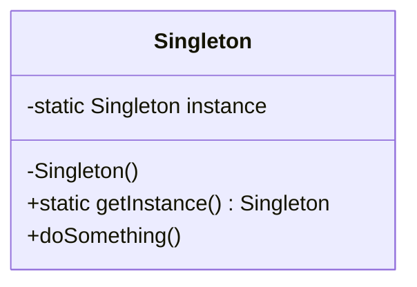

# Singleton Pattern

**Category:** Creational

## Definition
The Singleton pattern ensures that a class has only **one instance** and provides a **global point of access** to it. It is commonly used for logging, driver objects, caching, and thread pool management.

## Real-World Analogy
Think of a **Government**. A country can have only one official government. Regardless of the personal identities of the individuals who form governments, the title, "The Government of X", is a global point of access that identifies the group of people in charge.

## UML Diagram

## Common Myths & Debusting
- **Myth 1: "Singleton is exactly the same as a global variable."**
  *Reality:* Global variables can be re-assigned. Singleton ensures the instance is strictly controlled and lazy-loaded (created only when requested).
- **Myth 2: "Singletons are completely thread-safe by default."**
  *Reality:* In multithreaded environments (like Java), a poorly implemented Singleton can create multiple instances. You must use synchronization, Double-Checked Locking, or an Enum.

## Code Example Summary
- `BadSingleton.java`: Demonstrates what happens when multiple threads try to access a naive singleton simultaneously (creates multiple instances).
- `ThreadSafeSingleton.java`: The correct way using "Double-Checked Locking".
- `EnumSingleton.java`: The absolute best and most robust way to implement Singleton in Java (handles serialization and reflection attacks).
