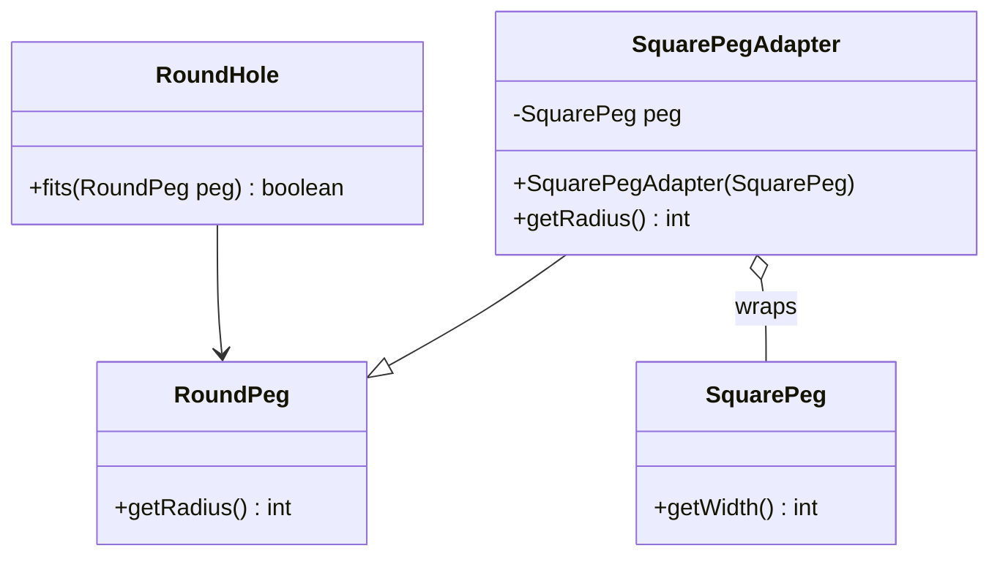

# Adapter Pattern

**Category:** Structural

## Definition
The Adapter pattern allows objects with incompatible interfaces to collaborate. It acts as a wrapper between two objects, catching calls for one object and transforming them to format and interface recognizable by the second object.

## Real-World Analogy
Think of traveling from the **USA to Europe**. Your laptop charger has a flat-pronged US plug (Client). The wall socket in Europe has round holes (Adaptee). You cannot plug your laptop directly into the wall. 
You buy a **Power Adapter**. You plug your flat US plug into the Adapter, and the Adapter plugs its round prongs into the European wall socket. The Adapter translates the interface without modifying your laptop or the wall socket.

## UML Diagram

## Common Myths & Debusting
- **Myth 1: "Adapter and Bridge are the same pattern."**
  *Reality:* They are structurally similar but have different intents. Adapter is used to make things work *after* they're designed (retrofitting an old API). Bridge is designed up-front to let abstraction and implementation vary independently.
- **Myth 2: "Adapters should contain complex business logic."**
  *Reality:* No! An adapter's only job is data/interface transformation. If you are adding new business logic, you are building a Decorator, not an Adapter.

## Code Example Summary
- `BadClient.java`: Shows the compilation error that happens when trying to pass an incompatible `SquarePeg` to a `RoundHole`.
- `RoundHole.java` & `RoundPeg.java`: The existing, compatible system (Target).
- `SquarePeg.java`: The incompatible class (Adaptee).
- `SquarePegAdapter.java`: The wrapper that makes `SquarePeg` look like a `RoundPeg` by calculating a circle that can fit the square.
