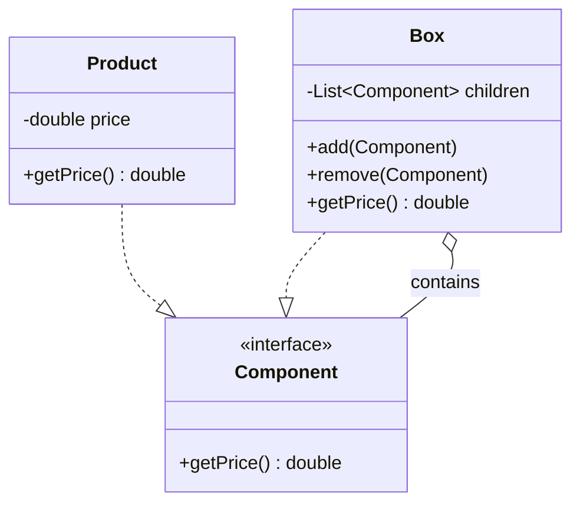

# Composite Pattern

**Category:** Structural

## Definition
The Composite pattern lets you compose objects into tree structures and then work with these structures as if they were individual objects. It allows clients to treat individual objects and compositions of objects uniformly.

## Real-World Analogy
Think of an **Amazon Delivery Box**. Inside the main box, you might have smaller boxes, and inside those smaller boxes, you have actual products (like a phone or a book). 
If you want to calculate the total price of the order, you don't want to write complex logic to check if an item is a box or a product. You just want to call `getPrice()` on the main box, and it should recursively call `getPrice()` on all its children, whether they are smaller boxes or final products.

## UML Diagram

## Common Myths & Debusting
- **Myth 1: "Composite is just a Tree data structure."**
  *Reality:* While it uses a tree structure, the *intent* of the pattern is that the client code shouldn't care whether it is dealing with a leaf node (a single object) or a branch node (a composite). The key is the shared Interface.
- **Myth 2: "Every node must implement `add()` and `remove()` methods."**
  *Reality:* This is the "Transparency vs. Safety" debate. 
  - *Transparency:* Putting `add()`/`remove()` in the base interface means a client can treat all nodes exactly identically, but calling `add()` on a leaf might throw an error (unsafe).
  - *Safety:* Putting `add()`/`remove()` only in the Composite class is safer, but the client must cast to the Composite class to add items, losing some uniformity. Both are valid depending on the context!

## Code Example Summary
- `BadBox.java`: Uses `instanceof` checks to calculate the total price, violating OCP and making the code fragile.
- `Component.java`: The common interface declaring `getPrice()`.
- `Product.java`: The Leaf (an item that has a static price and no children).
- `Box.java`: The Composite (a container that holds `Component`s and recursively calculates the total price).
