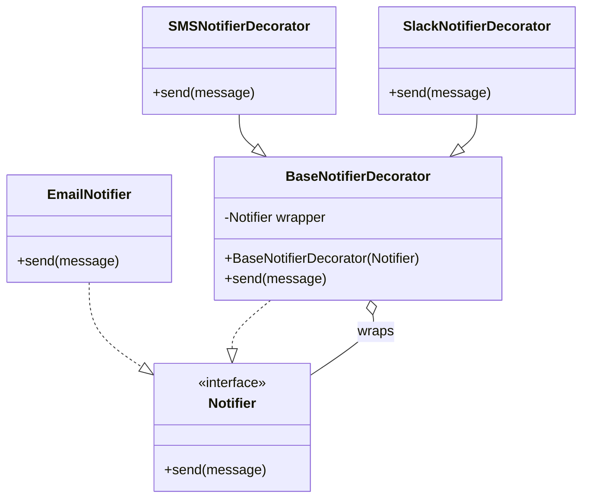

# Decorator Pattern

**Category:** Structural

## Definition
The Decorator pattern lets you attach new behaviors to objects by placing these objects inside special wrapper objects that contain the behaviors. It provides a flexible alternative to subclassing for extending functionality.

## Real-World Analogy
Think of **Wearing Clothes**. You are cold, so you wrap yourself in a sweater. You're still cold, so you wrap a jacket over the sweater. If it's raining, you put on a raincoat over the jacket. 
All of these garments "decorate" your basic behavior (being a person) with new behaviors (being warm, being waterproof), but they don't change *who* you are. You can dynamically add or remove them at runtime.

## UML Diagram

## Common Myths & Debusting
- **Myth 1: "Decorator is just another name for Inheritance."**
  *Reality:* It's the exact opposite! Decorator favors *Composition over Inheritance*. Instead of creating `EmailAndSMSNotifier`, `EmailAndSlackNotifier` subclasses (Class Explosion), you compose them at runtime: `new SMSDecorator(new SlackDecorator(new EmailNotifier()))`.
- **Myth 2: "Decorators change the object's interface."**
  *Reality:* No, decorators *must* implement the exact same interface as the object they are wrapping. If you change the interface, you are building an *Adapter*, not a Decorator.

## Code Example Summary
- `BadNotifier.java`: Demonstrates the "Class Explosion" problem if you try to use Inheritance to add multiple features.
- `Notifier.java`: The base Component interface.
- `EmailNotifier.java`: The Concrete Component (the core object).
- `BaseNotifierDecorator.java`: The abstract decorator holding the wrapped object.
- `SMSNotifierDecorator.java`: A concrete decorator that adds SMS capabilities on top of the wrapped object's capabilities.
