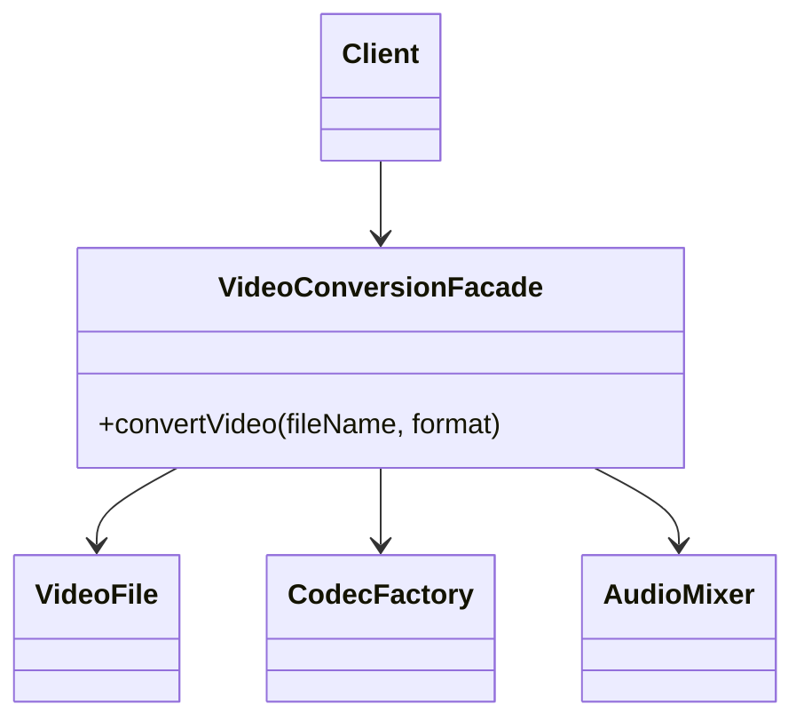

# Facade Pattern

**Category:** Structural

## Definition
The Facade pattern provides a simplified interface to a library, a framework, or any other complex set of classes. It hides the underlying complexity of the subsystems and exposes only what the client actually needs.

## Real-World Analogy
Think of ordering food at a **Drive-Thru**. 
Behind the scenes, there is immense complexity: the fry cook, the grill operator, the cashier, the inventory system, the drink machine. 
But as a customer (Client), you don't interact with all of them. You interact with the **Order Taker (Facade)**. You just say "Give me a Burger Meal," and the Facade coordinates all the complex subsystems behind the scenes to deliver your food.

## UML Diagram

## Common Myths & Debusting
- **Myth 1: "Facade prevents you from accessing the subsystem directly."**
  *Reality:* Facade *provides* a simplified interface, but it doesn't *hide* or *block* the subsystem. If a power-user client needs to use the complex subsystem directly, they absolutely can! It just offers a shortcut for the 90% of standard use cases.
- **Myth 2: "Facade is the same as Adapter."**
  *Reality:* Adapter converts *one* existing interface into another to make things compatible. Facade simplifies a *whole group* of interfaces. Also, Adapter usually wraps a single object, while Facade deals with an entire subsystem of objects.

## Code Example Summary
- `BadClient.java`: The client has to know about `VideoFile`, `CodecFactory`, `AudioMixer`, etc., to convert a simple video. The client code is bloated with configuration.
- `Subsystem Classes`: (Simplified for the example) Represents the complex underlying framework.
- `VideoConversionFacade.java`: Provides a single, simple `convertVideo("file.mp4", "ogg")` method that handles all the subsystem orchestration behind the scenes.
