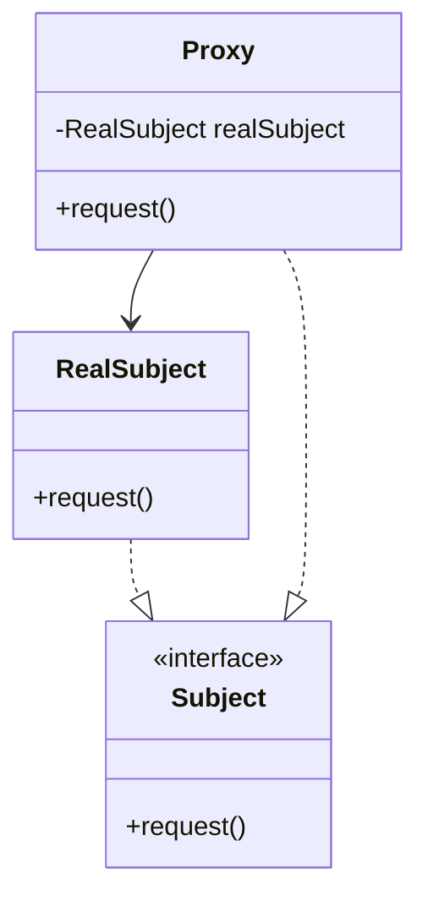

# Proxy Pattern

**Category:** Structural

## Definition
The Proxy pattern provides a surrogate or placeholder for another object to control access to it. This can be used for lazy initialization (Virtual Proxy), access control (Protection Proxy), logging, caching, etc.

## Real-World Analogy
Think of a **Credit Card**. A credit card is a proxy for a bank account, which is a proxy for a bundle of cash. Both implement the same "interface" (they can be used to make a payment). 
Another example: A **Bouncer at a Club**. The bouncer (Proxy) controls access to the club (Real Subject). If you don't meet the criteria (underage), the bouncer blocks you from reaching the real subject.

## UML Diagram

## Common Myths & Debusting
- **Myth 1: "Proxy and Decorator are the exact same thing."**
  *Reality:* Structurally, they are very similar (both wrap an object and implement its interface). However, their *intent* is completely different. 
  - **Decorator** adds *new* behavior (e.g., adding SMS capabilities).
  - **Proxy** *controls access* to the existing behavior (e.g., lazy loading, caching, security), without adding new business logic. Furthermore, a Proxy usually manages the lifecycle of its Real Subject (creates it), whereas a Decorator takes the wrapped object from the client.
- **Myth 2: "Proxies are only for security/access control."**
  *Reality:* Virtual Proxies (lazy loading a heavy image only when it's rendered on screen) and Cache Proxies (returning cached DB results) are extremely common uses of this pattern.

## Code Example Summary
- `BadInternet.java`: Directly accesses websites without any filtering or control.
- `Internet.java`: The Subject interface.
- `RealInternet.java`: The Real Subject that actually makes the connection.
- `ProxyInternet.java`: The Proxy that checks a list of banned sites before allowing the connection to be passed to the `RealInternet`.
